# Multi-Stream FPGA-Based Anomaly Detection for IoT Data

## Overview

This repository presents a **hardware-accelerated, multi-stream anomaly detection architecture** designed for **Internet of Things (IoT) edge computing** scenarios. The project focuses on implementing and optimizing the **Z-Score anomaly detection algorithm** on **FPGA platforms**, with a particular emphasis on **resource efficiency, scalability, and high-throughput streaming data processing**.

Modern IoT systems are characterized by:

* A rapidly growing number of connected devices
* High-volume, continuous sensor data streams
* The need for near-real-time processing at the network edge

Sensor data often contains **anomalies**, defined as deviations from expected behavior, which may be caused by:

* Environmental or meteorological phenomena
* Sensor degradation or hardware faults
* Calibration errors
* Cyberattacks or malicious data injection

Detecting these anomalies **before data reaches the cloud** reduces bandwidth usage, improves system robustness, and enables faster responses.

---

## Computing Architecture

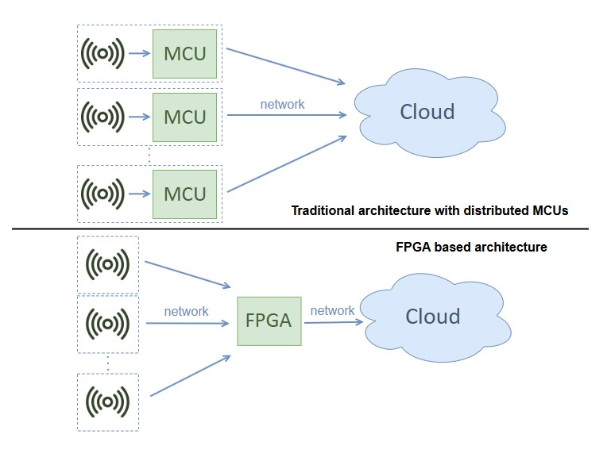

### Distributed MCU-Based Processing

**Advantages:**

* Local processing close to sensors
* Low power consumption

**Disadvantages:**

* Limited parallelism
* Many maintenance points
* Poor scalability for multi-stream processing

### Centralized FPGA-Based Processing

**Advantages:**

* Massive parallelism
* Pipeline processing
* Native support for multi-stream architectures
* Optimized cost-performance ratio at scale

This project focuses on the **FPGA-based centralized approach**.

---

## Z-Score Anomaly Detection Algorithm

The Z-Score method identifies anomalies by measuring how far a data point deviates from the mean in terms of standard deviations.

### Advantages

* Simple mathematical formulation
* Effective for detecting **point anomalies (spikes)**
* Suitable for hardware implementation
* Assumes Gaussian-like data distributions
  
  * Approximately 68% of the values lie within the interval [μ − σ, μ + σ]
  * Approximately 95% of the values lie within the interval [μ − 2σ, μ + 2σ]
  * Approximately 99.7% of the values lie within the interval [μ − 3σ, μ + 3σ]

---

## Hardware Challenges and Solutions

### Challenges

1. Mean and standard deviation cannot be computed upfront in streaming data
2. Naive recomputation leads to **O(n)** complexity
3. Risk of arithmetic overflow due to cumulative sums

### Implemented Solutions

* **Sliding window sampling** with a fixed-size FIFO buffer

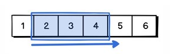

* **Running sums** with constant-time updates (O(1))

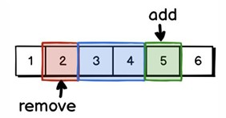

* **Initialization phase** managed by a Finite State Machine (FSM)

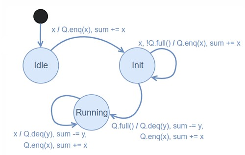

* Precision-overflow trade-off via bounded window size

---

## Sliding Window Z-Score Architecture

Key architectural features:

* FIFO-based sliding windows for each data stream
* Separate initialization and normal operation phases
* Fully pipelined design for high throughput

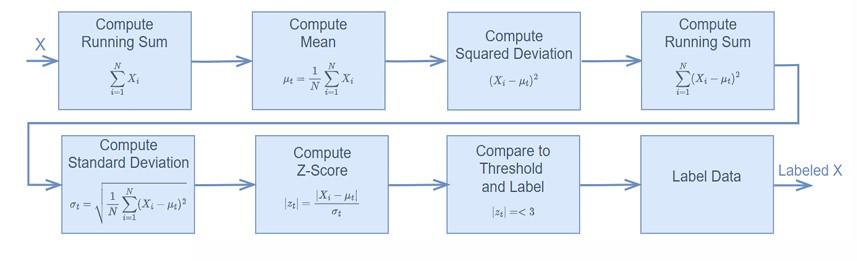

---

## Running Sum Design

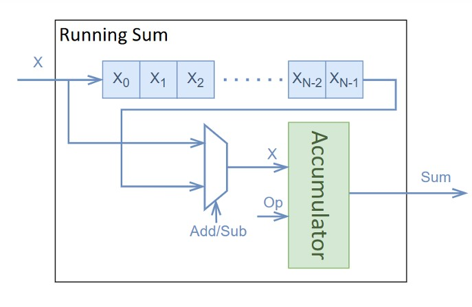

The running sum module is one of the most complex components and includes:

* FIFO queue for sliding window management
* Accumulator for maintaining the current sum
* FSM-based control logic
* Support for operations: ENQ, DEQ, ADD, SUB

This design enables constant-time updates for streaming data.

---

## Single-Stream vs Multi-Stream Design

### Single-Stream Z-Score

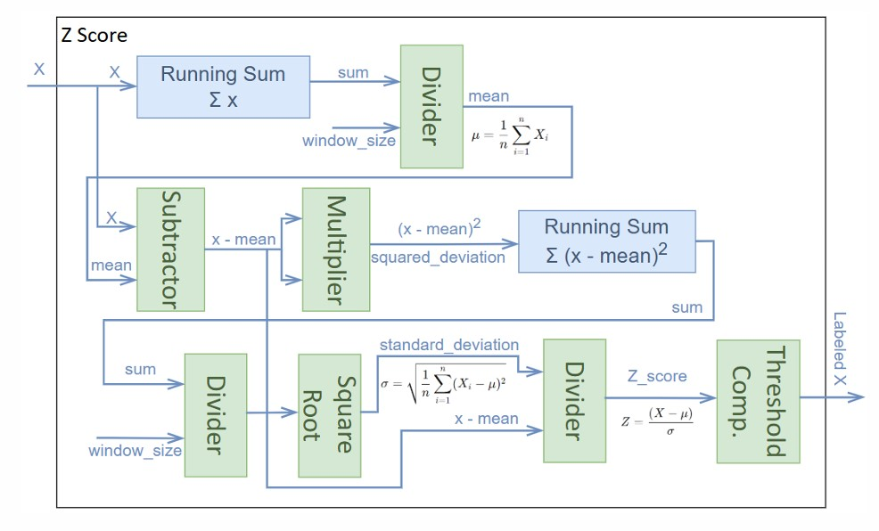

* Dedicated computation path
* Simple control logic
* Inefficient resource usage when scaled

### Multi-Stream Z-Score

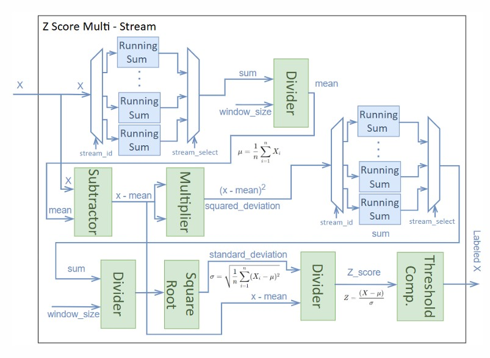

* Independent sampling window per stream
* Independent running sums per stream
* Shared arithmetic units (adders, subtractors, multipliers, dividers)
* **Round-Robin scheduling** for stream selection
* Deterministic data ordering eliminates the need for stream ID buffering

---

## Multi-Stream FPGA Implementation

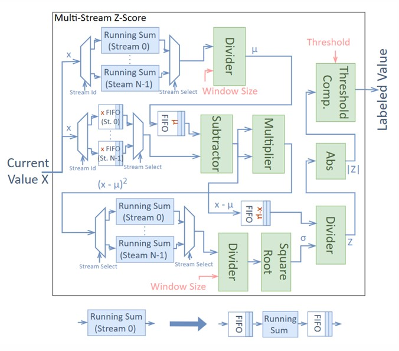

Key implementation aspects:

* Per-stream FIFO buffering to support multiple operations per input
* Shared computation blocks to minimize resource usage
* AXI4-Stream interfaces for modular connectivity
* Fully pipelined data path

Detailed circuit diagrams are provided in the project appendices.

---

## Streaming Interfaces (AXI4-Stream)

The design uses the **AXI4-Stream protocol**, which provides:

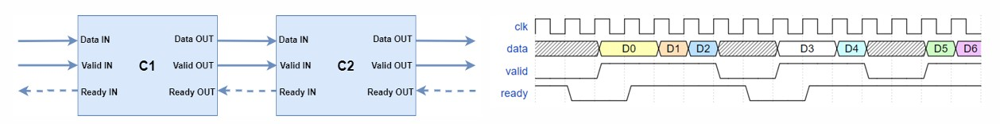

* Ready/valid handshake for robust data transfer
* Flow control to prevent data loss or deadlock
* Clear separation of data and control paths
* Easy integration into modular FPGA designs

---

## Validation on FPGA

Validation was performed using predefined datasets with manually computed Z-Scores.

### Results

* High detection accuracy for point anomalies

> Header: Expected Value / Obtained Value / Absolute Difference

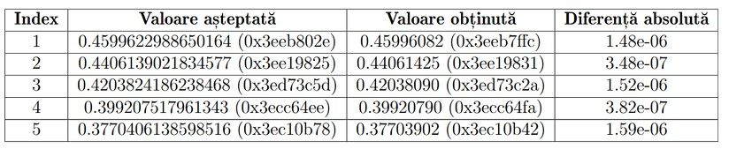

* Small numerical errors (~1e-6) due to 32-bit vs 64-bit floating-point precision

> Header: Type of Anomaly / True Positive / False Positive / True Negative / False Negative / Precision / Recall / Accuracy / F1 Score

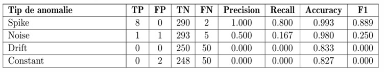

* Correct classification of normal vs anomalous data points (mainly for spike anomalies)

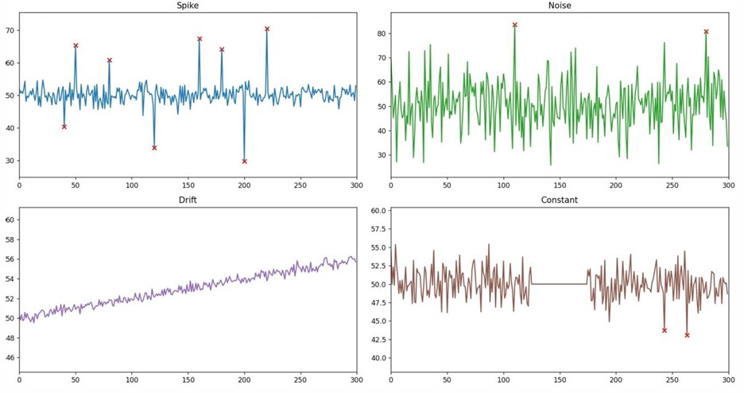

---

## Scalability Analysis

### FPGA Platforms

* **Zynq UltraScale**

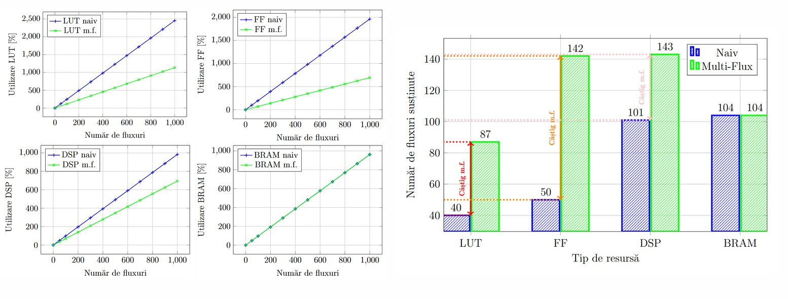

* **Nexys A7-100T**

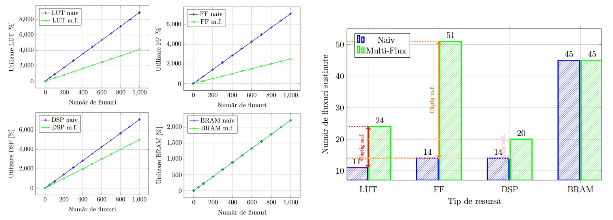

Comparisons include:

* Resource utilisation for replicated single-stream architectures vs optimized multi-stream pipeline architecture
* Amount of circuit instances that can fit on one FPGA

Results show superior scalability and resource utilization for the multi-stream approach.

---

## MCU Scalability Comparison

Tested platforms:

* **ATmega328P**: up to 6 parallel streams (window size = 64)
* **ESP8266**: up to 188 parallel streams (window size = 64)

While MCUs scale reasonably for simple tasks, they suffer from increased latency and limited throughput compared to FPGA implementations.

---

## Performance and Energy Efficiency

* FPGA multi-stream implementation achieves significantly lower latency
* Higher throughput compared to MCU solutions
* Energy consumption remains comparable when normalized to performance

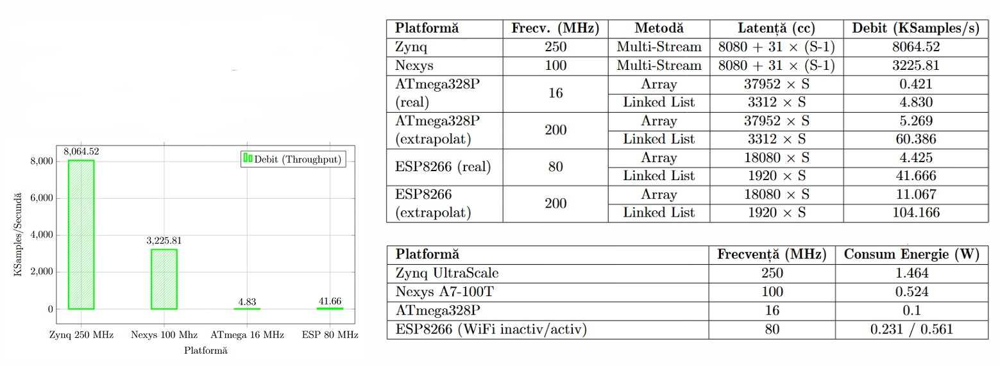

---

## Implementation Details

* Floating-point format: IEEE 754, 32-bit
* Output format:

  * 32-bit Z-Score value
  * 16-bit stream ID
  * 16-bit status flags (normal/anomaly)
* Maximum window size: 64 samples
* FIFO depth: 128 (to avoid initialization deadlocks)
* HDL: VHDL
* Tools: Xilinx Vivado, IP cores (FIFO, Floating-Point Math)
* Communication: AXI4-Stream, UART
* FPGA boards: Zynq UltraScale, Nexys A7-100T
* MCU boards: ATmega328P, ESP8266
* GUI: Python + Tkinter

---

## User Interface

A Python-based GUI was developed for demonstration and validation:

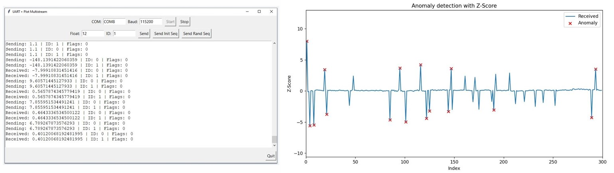

* UART communication with FPGA
* COM port and baud rate selection
* Real-time data transmission and visualization
* Predefined initialization and testing sequences
* Multithreaded reception to avoid blocking

---

## Appendices (Hardware Modules)

* **Appendix 1:** Running Sum (FSM-based, multi-operation per input)

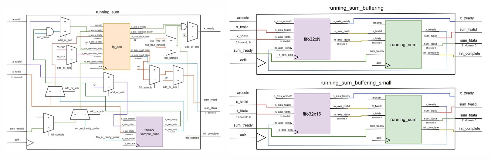
  
* **Appendix 2:** Running Mean (multi-stream, shared divider)

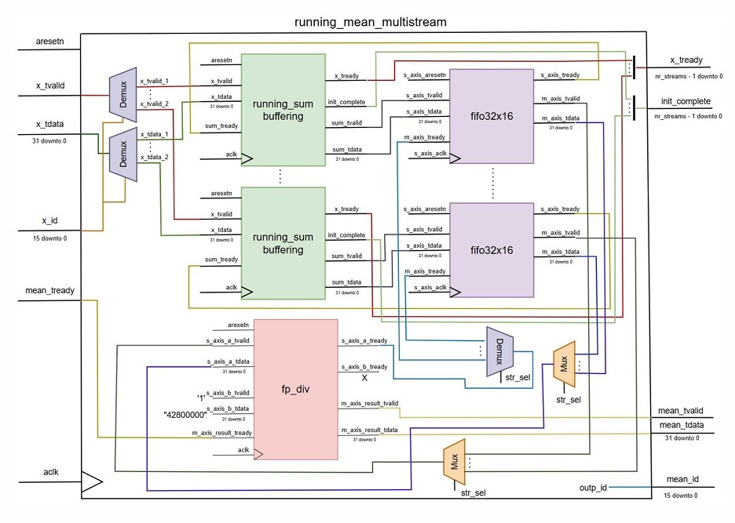

* **Appendix 3:** Squared Deviation Accumulation

* **Appendix 4:** Standard Deviation Computation

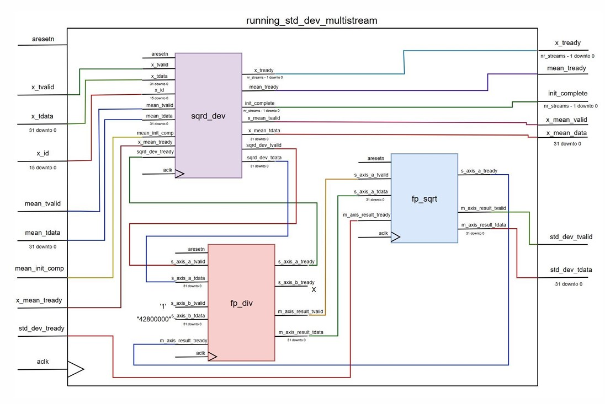
  
* **Appendix 5:** Integrated Z-Score Module

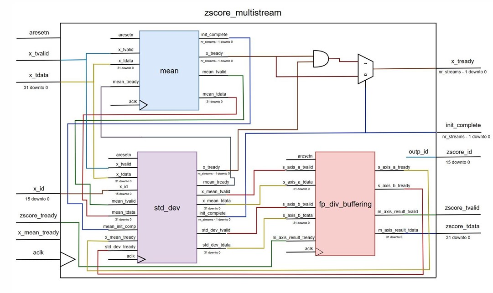

* **Appendix 6:** Threshold Comparator (absolute value + comparator)

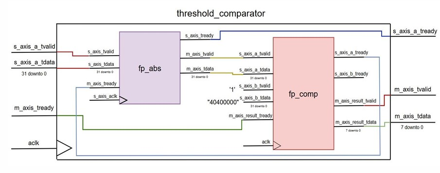
  
* **Appendix 7:** Performance and scalability metrics formulas

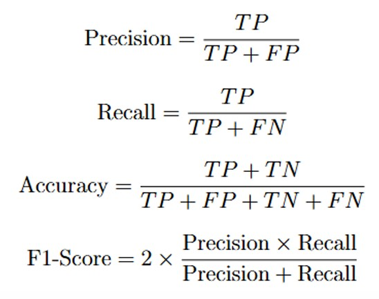

---

## Conclusions

* FPGAs are highly suitable for **multi-stream anomaly detection at the edge**
* Multi-stream architectures maximize hardware utilization
* FPGA solutions provide lower latency and higher throughput than MCUs
* Energy efficiency remains competitive when normalized by performance
* MCUs remain relevant for simpler, low-demand applications
